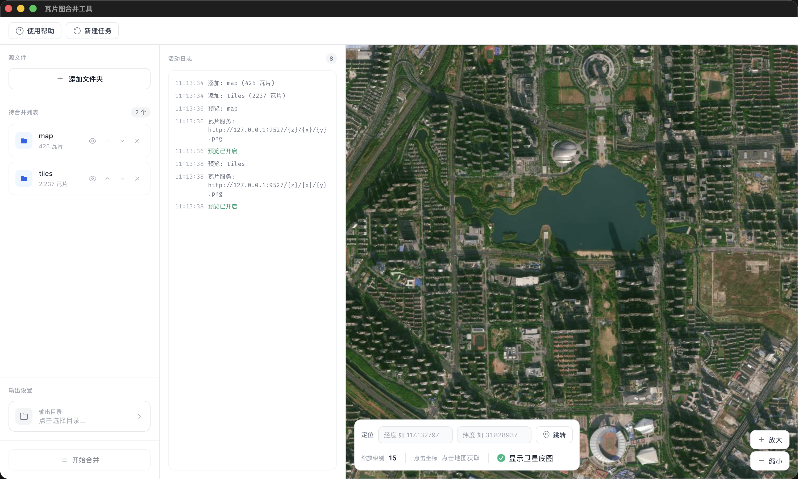

# Tile Merge

[](./README_CN.md)
[](./README_BUILD_GUIDE.md)

A desktop application built with **Tauri + Vue 3 + TypeScript** for merging multiple tile map folders.

## ✨ Features

- 📁 **Multi-folder Merging** - Add multiple tile folders and merge them in order
- 🖼️ **Smart Overlay** - Tiles at the same position are automatically alpha-blended
- 🗺️ **Live Preview** - Built-in map preview with Amap satellite basemap support
- 📍 **Coordinate Navigation** - Quick jump by entering coordinates, click map to get location
- ⚡ **High Performance** - Rust backend + Rayon parallel processing for fast merging
- 💻 **Cross-platform** - Supports macOS and Windows

## 📸 Screenshot



## 🚀 Quick Start

### Requirements

- [Node.js](https://nodejs.org/) 18+
- [Rust](https://www.rust-lang.org/tools/install) 1.70+
- [pnpm](https://pnpm.io/) or npm

### Install Dependencies

```bash
# Install frontend dependencies
npm install

# Install Tauri CLI (if not installed)
npm install -g @tauri-apps/cli
```

### Development Mode

```bash
npm run tauri dev
```

### Build for Production

```bash
# macOS
npm run build:mac

# Windows (cross-compile on macOS, or build on Windows)
npm run build:win
```

## 📖 User Guide

### Workflow

1. **Add Folders** - Click "Add Folder" to select directories containing tiles
2. **Adjust Order** - Use ⬆️⬇️ buttons to adjust merge order (folders later in the list overlay on top)
3. **Select Output Directory** - Set the save location for merged results
4. **Start Merge** - Click "Start Merge" and wait for completion
5. **Preview Results** - After merging, click "Preview Results" to view on the map
6. **New Task** - To start a new merge task, click "New Task" in the top left

### 📁 Tile Folder Format

Tile folders should contain subdirectories named by zoom level (XYZ format):

> ⚠️ **Important: Only PNG format tile files are supported**, JPG, WebP and other formats are not supported.

```text
tile-folder/
├── {z}/            ← Zoom level
│   ├── {x}/        ← X coordinate (column)
│   │   ├── {y}.png ← Y coordinate (row)

Example: 10/827/373.png
Represents tile at zoom level 10, X coordinate 827, Y coordinate 373
```

### 🔄 Merge Principle

#### Merge Logic

For each tile position (z/x/y), the program processes as follows:

- **First occurrence**: Directly copied to output directory
- **Subsequent occurrences**: If tile exists at that position in output, performs alpha blending overlay

#### Alpha Blending Algorithm

The program performs per-pixel transparency blending:

```
new_pixel = top_pixel × α + bottom_pixel × (1 - α)
```

- **α = 1 (fully opaque)**: Completely covers bottom layer
- **0 < α < 1 (semi-transparent)**: Blends with bottom layer for transition effect
- **α = 0 (fully transparent)**: Does not affect bottom layer

#### Processing Order

Processed in order from top to bottom of the folder list:

- Folders processed first serve as the "bottom layer"
- Folders processed later "overlay" on top

### 🖱️ Feature Description

#### File Management Area

| Action            | Description                                   |
| ----------------- | --------------------------------------------- |
| Add Folder        | Select tile directory, auto-scan tile count   |
| Preview 👁️        | View this folder's tiles on the map           |
| Move Up/Down ⬆️⬇️ | Adjust merge order                            |
| Remove ❌         | Remove from list                              |

#### Map Preview Area

| Feature          | Description                                       |
| ---------------- | ------------------------------------------------- |
| Location Jump    | Enter coordinates and click jump button           |
| Zoom Control     | Click zoom in/out buttons or use mouse wheel      |
| Get Coordinates  | Click anywhere on map to get coordinates          |
| Basemap Toggle   | Turn off satellite basemap to view tiles only     |

#### Keyboard Shortcuts

| Shortcut | Function                                    |
| -------- | ------------------------------------------- |
| F12      | Open developer tools                        |
| Enter    | Quick jump when in coordinate input field   |

### ❓ FAQ

**Q: Why can't I see tiles in preview?**

A: Please check:

1. Whether tile coordinates correspond to current map position
2. Whether zoom level matches current zoom level
3. Try turning off satellite basemap to view pure tile effect

**Q: Some tiles are missing after merge?**

A: Ensure all source folders have correct directory structure in z/x/y.png format.

**Q: How to control overlay effect?**

A: By adjusting folder order. Folders later in the list will overlay on top.

## 🏗️ Technical Architecture

```
tile-merge-app/
├── src/                    # Vue frontend
│   ├── api/               # Tauri command call wrappers
│   ├── components/        # Vue components
│   ├── composables/       # Vue Composables
│   └── types.ts           # TypeScript type definitions
│
└── src-tauri/             # Rust backend
    └── src/
        ├── lib.rs         # Tauri command entry
        ├── merger.rs      # Tile merge core logic
        └── tile_server.rs # Local tile HTTP server
```

### Core Dependencies

| Layer     | Tech Stack                                    |
| --------- | --------------------------------------------- |
| Framework | [Tauri 2.0](https://tauri.app/)               |
| Frontend  | Vue 3 + TypeScript + Vite                     |
| Map       | [Leaflet](https://leafletjs.com/)             |
| Image     | [image-rs](https://github.com/image-rs/image) |
| Parallel  | [Rayon](https://github.com/rayon-rs/rayon)    |

## 🛠️ Development

### Recommended IDE Setup

- [VS Code](https://code.visualstudio.com/)
- [Vue - Official](https://marketplace.visualstudio.com/items?itemName=Vue.volar) extension
- [Tauri](https://marketplace.visualstudio.com/items?itemName=tauri-apps.tauri-vscode) extension
- [rust-analyzer](https://marketplace.visualstudio.com/items?itemName=rust-lang.rust-analyzer) extension

### Common Commands

```bash
# Development mode
npm run tauri dev

# Type check
npx vue-tsc --noEmit

# Build frontend only
npm run build
```

## 🙏 Acknowledgments

Core merge logic references the following open source projects:

- [merge_tile_sets.pl](https://github.com/jlmcgraw/aviationCharts/blob/master/merge_tile_sets.pl) by jlmcgraw
- [Stack Exchange GIS](https://gis.stackexchange.com/questions/247717) - ImageMagick merge approach

## 📄 License

This project is licensed under [CC BY-NC-SA 4.0](https://creativecommons.org/licenses/by-nc-sa/4.0/).

- ✅ Free to use, copy, and modify
- ✅ Attribution required
- ❌ **Commercial use prohibited**
- ⚠️ Derivative works must use the same license

## 👤 Author

nanvon
